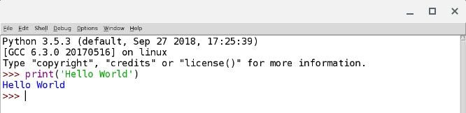

# Chapter 0
The main parts of the chapter pertain to:
- Who is the book for: General Population
- Ready your environment: Install Python
- How to ask questions: Set Context
## Ready the environment:
I am running the Linux(Beta) setup on my Acer Chrombook Spin 13. Therefore any of the references I make will be for the Linux steps.

Open the shell and install the packages: 
1. `sudo apt-get install python3`
2. `sudo apt-get install idle3`
3. `sudo apt-get install python3-pip`
## Experiment with some commands
Open the idle [Integrated DeveLopment Environment](https://en.wikipedia.org/wiki/IDLE) and try a "print" command.
- `idle3`
- `print('Hello world!')`

## Ask Smart Programming Questions
- Describe the why and what
- Describe the environment
- Use some tools:
- Search engine
- [Stack Overflow] (http://stackoverflow.com/)
- [“learn programming” subreddit](http://reddit.com/r/learnprogramming/)

