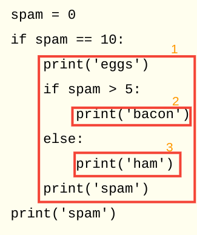
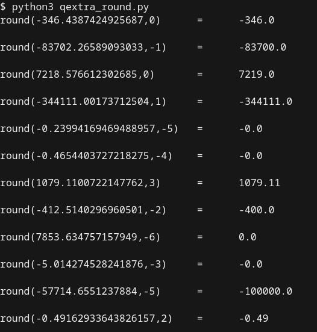
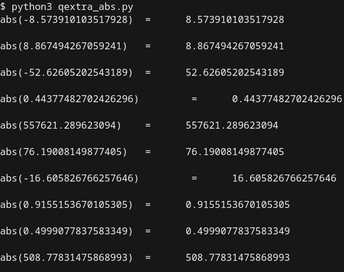

# Chapter 2 - Flow Control
Chapter 2 adds in the ability to control the execution of the program with the introduction of boolean and comparison operators, if blocks, and loops. Al finishes the chapter with the import statements which allow you to build with other's contributions.

## Accompanying Videos:
- [Lesson 4 - Flow charts, boolean values, comparison operators, boolean operators](https://www.youtube.com/watch?v=4XA9CKJJbr4)
- [Lesson 5 - if, elif, and else](https://www.youtube.com/watch?v=lWeCgEbk-Ro)
- [Lesson 6 - while Loops, break, and continue](https://www.youtube.com/watch?v=885qKiiKisI)
- [Lesson 7 - for Loops and range()](https://www.youtube.com/watch?v=HFQGxh1jY3g)
- [Lesson 8 - import Statements, sys.exit(), the pyperclip Module](https://www.youtube.com/watch?v=xJLj6fWfw6k)

## Summary Notes

**Comparison Operators**

Operator | Meaning
---------|---------
\==|Equal to
\!=|Not equal to
\<|Less than
\>|Greater than
\<=|Less than or equal to
\>=|Greater than or equal to

**Boolean Values**
- True
- False

**Boolean Operators**
- and
- or
- not

**if-elif-else**
- if statement: conditionally execute code 
- elif: executes if condition true and all previous have been false
- else: at the end; executes if all previous conditions have been false
- falsey values: 0, 0.0 and empty string '' are considered false; however better to be explicit in code

**while**
- while: a loop which executes code, when reachs end of block, back to start, re-check condition
- break: leave current cycle of loop, do not re-check condition
- condition: leave current cycle of loop, back to start, and re-check condition

**For Loop**
- for loop: block of code executed a number of times as defined in control
- [range](https://docs.python.org/3/library/functions.html#func-range): create immutable sequence of numbers; call with 1 (stop), 2 (start, stop) , or 3 (start, stop, step) arguments 

**Modules**
- Standard Library: modules that come with python
- sys.exit(): quit program
- pyperclip: 3rd-party module with copy(), paste() functions for reading/writing to clipboard
- import LIBRARY_NAME: load external libraries into the program; will require usage by calling LIBRARY_NAME.FUNCTION
- from LIBRARY_NAME import \*: load all the functions from LIBRARY_NAME; does not require usage by calling LIBRARY_NAME.FUNCTION, but makes code less readable

## Other Resources
[pythontutor.com](pythontutor.com)

-----

# Chapter 2 - Practice Questions

Q1. What are the two values of the Boolean data type? How do you write them?

True, False

Q2. What are the three Boolean operators?

and, or, not

Q3. Write out the truth tables of each Boolean operator (that is, every possible combination of Boolean values for the operator and what they evaluate to).

**`and` Operator Truth Table**

Expression|Evaluation
----------|------
True and True|True
True and False|False
False and True|False
False and False|False

**`or` Operator Truth Table**

Expression|Evaluation
----------|------
True or True|True
True or False|True
False or True|True
False or False|False

**`not` Operator Truth Table**

Expression|Evaluation
----------|------
not True|False
not False|True


Q4. What do the following expressions evaluate to?

Expression|Evaluation
----------|------
(5 > 4) and (3 == 5)|False
not (5 > 4)|False
(5 > 4) or (3 == 5)|True
not ((5 > 4) or (3 == 5))|False
(True and True) and (True == False)|False
(not False) or (not True)|True

Q5. What are the six comparison operators?

**Comparison Operators**

Operator | Meaning
---------|---------
\==|Equal to
\!=|Not equal to
\<|Less than
\>|Greater than
\<=|Less than or equal to
\>=|Greater than or equal to

Q6. What is the difference between the equal to operator and the assignment operator?

- equal to - compares values and returns true if equivalent
- assignment - assigns a value to a variable 

Q7. Explain what a condition is and where you would use one.
- evaluation of truth; to control the flow of program logic

Q8. Identify the three blocks in this code:



Q9. Write code that prints Hello if 1 is stored in spam, prints Howdy if 2 is stored in spam, and prints Greetings! if anything else is stored in spam.

``` python
continue_flag = 'Y'
while continue_flag == 'Y':
    print('Please enter a value for spam')
    spam = input()
    if spam == '1':
        print('Hello')
    elif spam == '2':
        print('Howdy')
    else:
        print('Greetings!')
    print('Continue? (Y for YES, Anything else is NO)')
    continue_flag = input()
```

Q10. What can you press if your program is stuck in an infinite loop?

ctrl+c

Q11. What is the difference between break and continue?
- break: exit the entire loop, do not go back to beginning of loop to re-evaluate condition
- continue: exit the current "cycle" of the loop, go back to beginning of loop to re-evaluate condition

Q12. What is the difference between range(10), range(0, 10) and range(0,10,1) in a for loop?
Nothing

Q13. Write a short program that prints the numbers 1 to 10 using a for loop. Then write an equivalent program that prints the numbers 1 to 10 using a while loop.

```python
# 1 to 10 in for loop
for num in range(1,10):
    print(num)

# 1 to 10 in while loop
num = 1
while num < 10:
    print(num)
    num = num + 1
```

Q14. If you had a function named bacon() inside a module named spam, how would you call it after importing spam?

```python
import spam
spam.bacon()
```

Extra credit: Look up the round() and abs() functions on the Internet, and find out what they do. Experiment with them in the interactive shell.

- round(): Experiment with random library and round together. How does the round() function work with varying inputs?
```python
# Extra credit question: investigate round() function with using random scenarios and check the result

import random

def numofdigits():
    return random.randint(-6, 6)

def coinflip():
    return random.choice([-1,1])

def multiplier():
    return 10 ** random.randint(0,6)

for num in range(25):
    numbertoround = random.random() * multiplier() * coinflip()
    placestoround = numofdigits()
    print('round(' + str(numbertoround) + ',' + str(placestoround) + ')\t = \t',end='')
    print(str(round(numbertoround, placestoround)),end='\n\n')
```


- abs(): Experiment with random library and absolute. How does the abs() function work with varying inputs?
```python
# Extra credit question: investigate abs() function with using random scenarios and check the result

import random

def coinflip():
    return random.choice([-1,1])

def multiplier():
    return 10 ** random.randint(0,6)

for num in range(10):
    numbertoabsolute = random.random() * multiplier() * coinflip()
    print('abs(' + str(numbertoabsolute) + ')\t = \t',end='')
    print(str(abs(numbertoabsolute)),end='\n\n')
```

