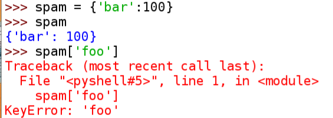
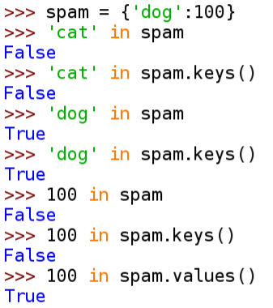

# Chapter 5 - Dictionaries and Structuring Data
In [Chapter 5](https://automatetheboringstuff.com/chapter5/) the main topic is dictionaries. They are very similar to lists, but insteadh store key-value pairs of information rather than an ordered list. Dictionaries are used extensively in python.

## Summary Notes

- dictionary: collection of key-value pairs; similar to a list, however the values are unordered and stored / accessed via a key
- dictname.values(): dictionary method for accessing all the values; returns a "list like" object *dict_values*
- dictname.keys(): dictionary method for accessing all the keys; returns a "list like" object *dict_keys*
- dictname.items(): dictionary method for accessing all the items; returns a "list like" object of tuples 
- check for membership: use _in_ or _not int_ similar to lists; can use in conjunction with the methods: _values()_, _keys()_, or _items()_; usage of the dictname defaults to searching the keys
- dictname.get(KEY, DEFAULTVALUE): will return the value of _KEY_ if it exists in the dictionary; else it will return the _DEFAULTVALUE_
- dictname.setdefault(KEY, VALUE): set _VALUE_ in a dictionary for _KEY_ if that key does not already exist in dictionary
- pprint.pprint(DICTNAME): pretty print; required import of pprint library
------
# Chapter 5 - Practice Questions
Q:1. What does the code for an empty dictionary look like?

```python
example_dict = {}
```

Q:2. What does a dictionary value with a key 'foo' and a value 42 look like?

```python
>>> dict_test = {}
>>> dict_test['foo'] = 42
>>> dict_test
{'foo':42}
```

Q:3. What is the main difference between a dictionary and a list?

##### a list generally stores individual items which are ordered; a dictionary stores unordered items which are referred to/accessed by a key

Q:4. What happens if you try to access spam['foo'] if spam is {'bar': 100}?

##### an error will result: 'KeyError'
<p align="center">
  
</p>

Q:5. If a dictionary is stored in spam, what is the difference between the expressions 'cat' in spam and 'cat' in spam.keys()?

##### there is no difference.  first is checking to see if 'cat' is one of the values of the spam dictionary

<p align="center">
  
</p>

Q:6. If a dictionary is stored in spam, what is the difference between the expressions 'cat' in spam and 'cat' in spam.values()?

##### the first expression checks for 'cat' in the keys of spam; where as the 2nd expression checks for 'cat' in the values

Q:7. What is a shortcut for the following code?
```python
if 'color' not in spam:
    spam['color'] = 'black'

# Here is how to do it in one line...
spam.setdefault('color', 'black')
```

Q:8. What module and function can be used to “pretty print” dictionary values?

##### use the pprint library

```python
import pprint

pprint.pprint(spam)
```
### Practice Projects
For practice, write programs to do the following tasks.

### Fantasy Game Inventory
You are creating a fantasy video game. The data structure to model the player’s inventory will be a dictionary where the keys are string values describing the item in the inventory and the value is an integer value detailing how many of that item the player has. For example, the dictionary value {'rope': 1, 'torch': 6, 'gold coin': 42, 'dagger': 1, 'arrow': 12} means the player has 1 rope, 6 torches, 42 gold coins, and so on.

Write a function named displayInventory() that would take any possible “inventory” and display it like the following:


Inventory:
- 12 arrow
- 42 gold coin
- 1 rope
- 6 torch
- 1 dagger
- Total number of items: 62
Hint: You can use a for loop to loop through all the keys in a dictionary.

```python
# inventory.py

def displayInventory(inventory):
    print("Inventory:")
    item_total = 0
    for k, v in inventory.items():
        print(v, k)
        item_total += v
    print("Total number of items: " + str(item_total))

def main():
    stuff = {'rope': 1, 'torch': 6, 'gold coin': 42, 'dagger': 1, 'arrow': 12}
    displayInventory(stuff)

if __name__ == "__main__":
    main()
```

### List to Dictionary Function for Fantasy Game Inventory
Imagine that a vanquished dragon’s loot is represented as a list of strings like this:


dragonLoot = ['gold coin', 'dagger', 'gold coin', 'gold coin', 'ruby']

Write a function named addToInventory(inventory, addedItems), where the inventory parameter is a dictionary representing the player’s inventory (like in the previous project) and the addedItems parameter is a list like dragonLoot. The addToInventory() function should return a dictionary that represents the updated inventory. Note that the addedItems list can contain multiples of the same item. Your code could look something like this:

```python
import fantasy_game_display

def addToInventory(inventory, addedItems):
    # your code goes here
    for item in addedItems:
        if item in inventory:
            inventory[item] += 1
        else:
            inventory.setdefault(item, 1)
    return inventory

def main():
    inv = {'gold coin': 42, 'rope': 1}
    dragonLoot = ['gold coin', 'dagger', 'gold coin', 'gold coin', 'ruby']
    inv = addToInventory(inv, dragonLoot)
    fantasy_game_display.displayInventory(inv)

if __name__ == "__main__":
    main()
```
The previous program (with your displayInventory() function from the previous project) would output the following:


Inventory:
- 45 gold coin
- 1 rope
- 1 ruby
- 1 dagger

- Total number of items: 48
